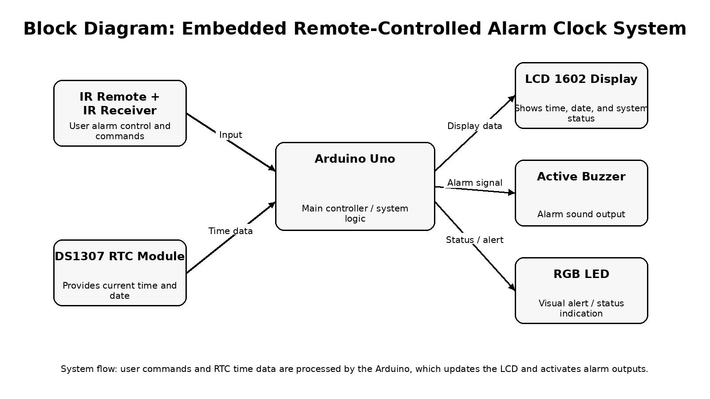
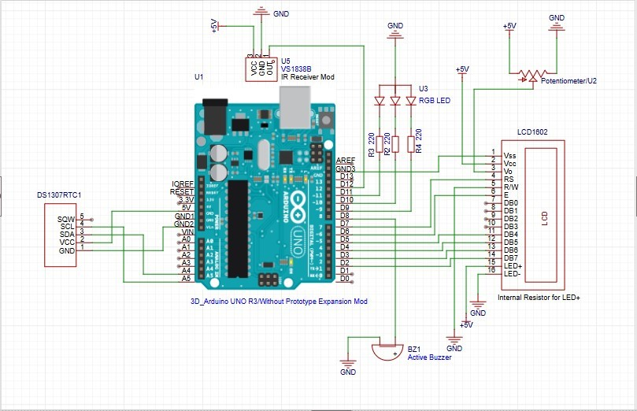
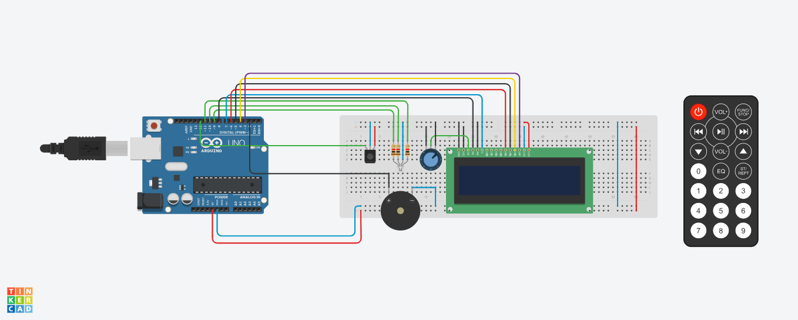

# Embedded Remote-Controlled Alarm Clock System

## Overview
The Embedded Remote-Controlled Alarm Clock System is an embedded systems project designed to display time and date while allowing the user to control alarm functions through a remote interface. The system combines hardware components such as a microcontroller, display module, input controls, and alert outputs to create a functional and interactive alarm clock prototype.

## Features
- Real-time clock and date display
- Remote-controlled user input
- Alarm setting and alarm triggering
- LCD output display
- Visual and audio alert system
- Embedded hardware and software integration

## Components Used
- Arduino Uno
- LCD1602 display
- DS1307 RTC module
- IR receiver module
- Remote control
- Active buzzer
- RGB LED
- Breadboard
- Jumper wires
- Potentiometer
- Resistors

## System Overview
The Arduino Uno acts as the main controller of the system. It receives time and date data from the RTC module, receives commands from the IR receiver, and controls the LCD, buzzer, and RGB LED based on the programmed alarm logic.

## Project Documentation
- [Project PDF Report](AlarmClockSystem.pdf)

## Images

### Block Diagram

### Schematic

### Breadboard Prototype Without DS1307 RTC

## Code
The source code for this project is stored in the  file.

## Future Improvements
- Printed circuit board version
- Better enclosure design
- Multiple alarm support
- Improved menu navigation
- Wireless control options

## Author
Jhóstin Sanchez
