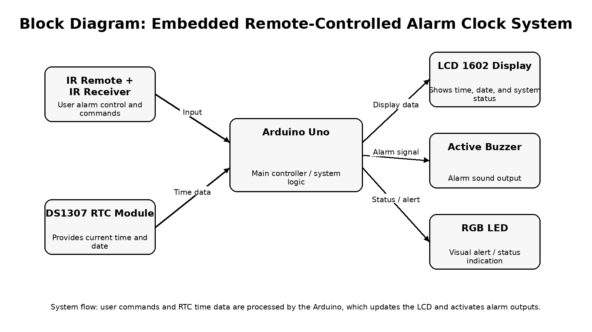
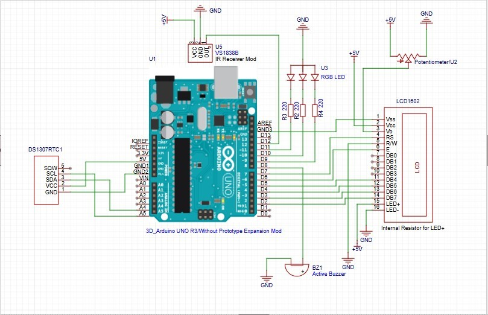
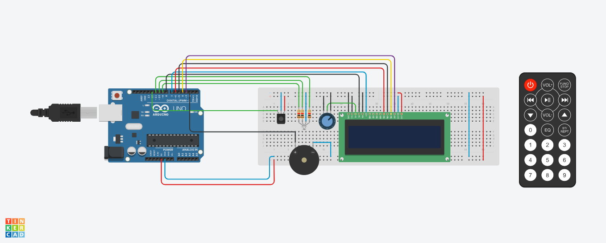

# Embedded Remote-Controlled Alarm Clock System

## Overview
The Embedded Remote-Controlled Alarm Clock System is an embedded systems project designed to display time and date while allowing the user to control alarm functions through a remote interface. The system combines hardware components such as a microcontroller, display module, input controls, and alert outputs to create a functional and interactive alarm clock prototype.

## Features
- Real-time clock and date display
- Remote-controlled user input
- Alarm setting and alarm triggering
- LCD output display
- Visual and audio alert system
- Embedded hardware and software integration

## Components Used
- Arduino Uno
- LCD1602 display
- DS1307 RTC module
- IR receiver module
- Remote control
- Active buzzer
- RGB LED
- Breadboard
- Jumper wires
- Potentiometer
- Resistors

## System Overview
The Arduino Uno acts as the main controller of the system. It receives time and date data from the RTC module, receives commands from the IR receiver, and controls the LCD, buzzer, and RGB LED based on the programmed alarm logic.

## Project Documentation
- [Project PDF Report](./doc/AlarmClockSystem.pdf)

## Images

### Block Diagram

### Schematic

### Breadboard Prototype Without DS1307 RTC

## Code
The main Arduino source file for this project is [`alarm_clock.ino`](./code/alarm_clock.ino).

## Future Improvements
- Printed circuit board version
- Better enclosure design
- Multiple alarm support
- Improved menu navigation
- Wireless control options

## Author
Jhóstin Sanchez

## Build and wiring reference

Install **LiquidCrystal**, **IRremote** (the version using `IRremote.hpp`), and **RTClib**. Open the sketch in Arduino IDE, accept creation of a matching sketch folder if requested, select Arduino Uno, and upload. Serial diagnostics use **9600 baud**; remote button codes are defined near the top of the sketch and may need adjustment for your remote.

| Function | Uno pins |
|---|---|
| LCD RS/E/D4/D5/D6/D7 | D7/D6/D5/D4/D3/D2 |
| Buzzer | D8 |
| RGB red/green/blue | D9/D10/D11 |
| IR receiver | D12 |
| DS1307 SDA/SCL | A4/A5 |

The prototype photo without a DS1307 demonstrates the UI build, not RTC timekeeping. RTC functions require a connected, initialized clock. The firmware generates a variable-frequency square wave; a passive piezo is appropriate for audible frequency changes, while an active buzzer produces its own tone.

## Maintenance verification

Daily alarm suppression now includes the calendar date: the same minute cannot retrigger on one day, but the next day's scheduled alarm can. On hardware, test a matching minute, silence it, confirm no same-minute repeat, then advance the RTC to the next day and confirm another alarm. Existing prototype reports are retained; this code review does not establish a new physical test result.

## License

Original source and documentation are available under the [MIT License](LICENSE). External dependencies, libraries, and third-party assets retain their respective licenses. Licensing does not imply that the prototype is calibrated, certified, or physically validated after later code changes.
